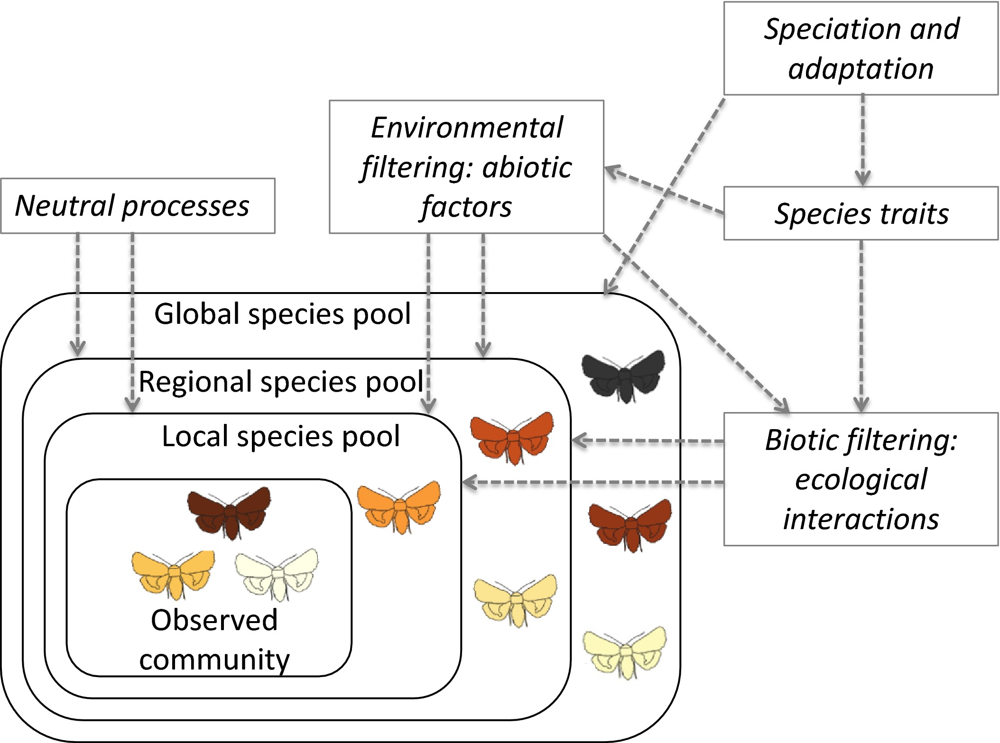

---
title:
author: "cjlortie, afilazzola, rdaigle"
date: "2018"
output:
  html_document:
    theme: lumen
    toc: yes
    toc_depth: 3
    toc_float: yes
  pdf_document:
    toc: yes
---
##A contrast of occupancy models for endangered species
 

###Purpose
To explore joint distribution models for endangered animal species listed within the San Joaquin Desert. Individual species occurrence data are typically scraped from gbif then Maxent models are used to predict and explore occupancy patterns include inference of niche. More than one species not tested concurrently within a region. [Hierarchical Modelling of Species Communities (HMSC)](https://onlinelibrary.wiley.com/doi/full/10.1111/ele.12757) is major innovation that can explore a measure of association amongst species in a region. A [recent package for R](https://github.com/guiblanchet/HMSC) has provided the means to directly apply this novel framework to occurrence data.

 

 
[ecoblender](http://ecoblender.org)
 

###Data
Select all federally listed endangered species within the San Joaquin Desert.
